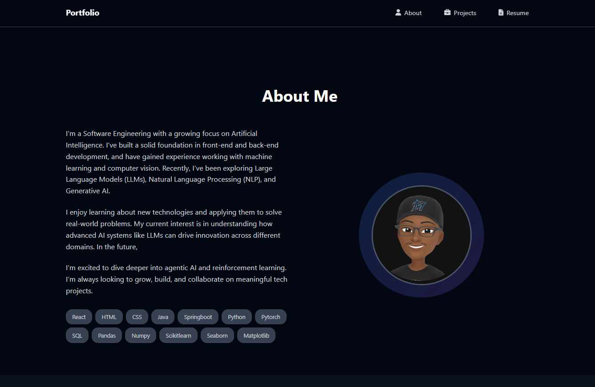

# My Portfolio Website

Welcome to my personal portfolio website repository!  
This project presents my professional profile, experience, skills, and projects in a clean, responsive web design.

---

## About the Project

This portfolio website serves as a digital resume and project showcase, designed to highlight my skills and experience as a Software and AI Engineer. It features:

- Responsive navigation menu  
- About Me section with skills and profile photo  
- Projects showcase with descriptions and GitHub links  
- Resume download section  
- Contact links to GitHub, LinkedIn, and email  

The website is built using **HTML**, **CSS**, and **JavaScript** with icons provided by Font Awesome.

---

## Screenshot



*(Replace this image with your preferred screenshot or photo)*

---

## Installation & Usage

1. Clone the repository:
   ```bash
   git clone https://github.com/HsnBGit/portfolio-website.git
